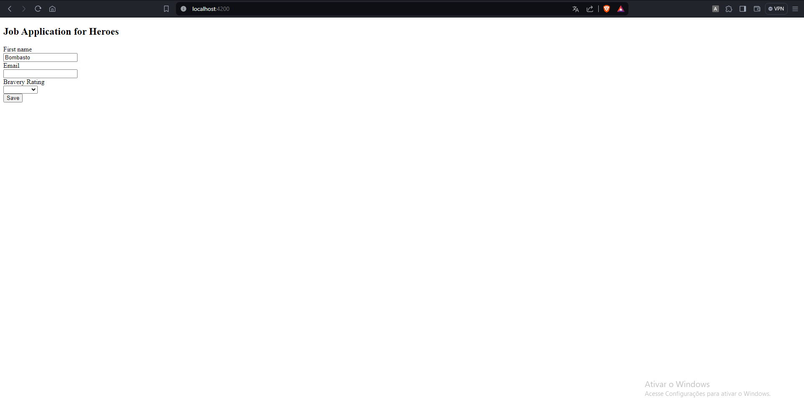
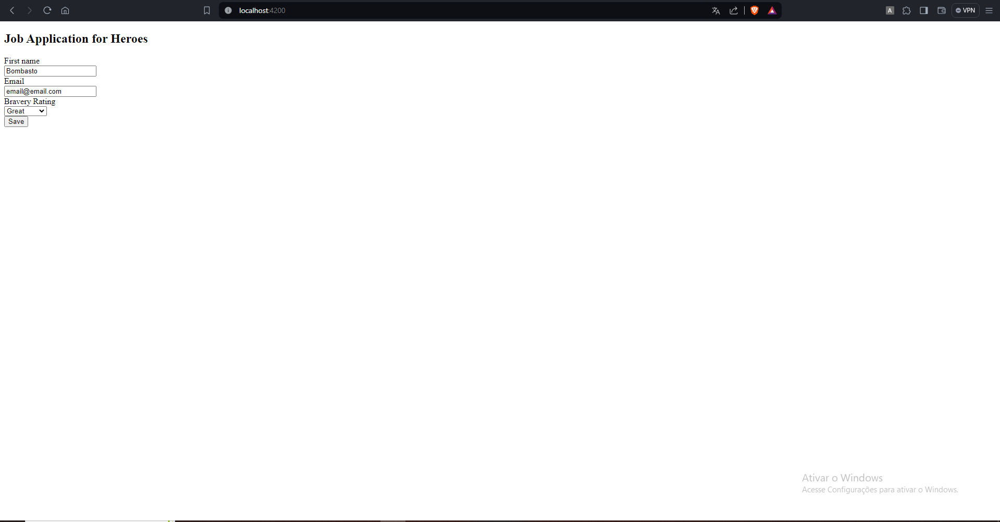
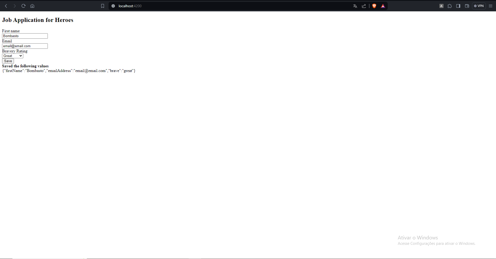

# Formulários Dinâmicos em Angular

Angular oferece uma abordagem robusta para a implementação de formulários dinâmicos, que se adaptam às necessidades do usuário em tempo real. Essa tecnologia permite que desenvolvedores criem formulários que mudam de acordo com a interação do usuário, dados de entrada, ou fontes de dados externas.

## Conceitos aprendidos

- **Reactive Forms**: Angular utiliza formulários reativos para uma abordagem mais flexível e escalável. Esses formulários facilitam a manipulação dinâmica de um número variável de campos de entrada.

- **FormArray**: Utilizado para gerenciar um conjunto dinâmico de controles de formulário.

- **FormBuilder**: Um serviço que simplifica a criação de instâncias de formulários programaticamente.

- **Validação**: Angular fornece ferramentas para validar campos de forma dinâmica, garantindo que os dados inseridos pelos usuários atendam a critérios específicos antes de serem processados.

## Benefícios

- **Flexibilidade**: Permite a criação de formulários que se adaptam a qualquer cenário, melhorando a experiência do usuário.
- **Validação Dinâmica**: Facilita a implementação de regras de validação complexas e específicas para cada campo.
- **Manutenção**: Simplifica a manutenção do código de formulários complexos, tornando o processo de desenvolvimento mais eficiente.

## Prints do projeto rodando

* Aplicação rodando local

* Campos do formulário inputados

* Resposta ao clicar em `save`

